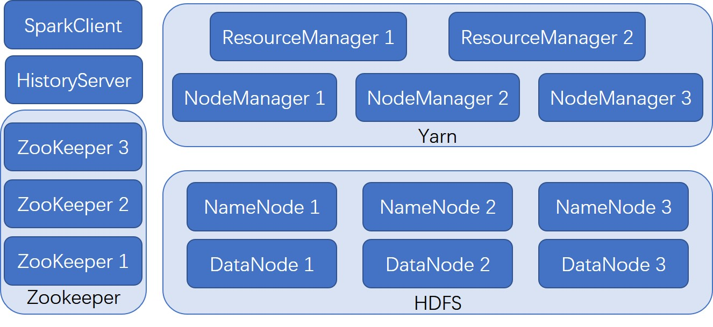

# Introduction
This repository helps to quickly deploy a spark-on-yarn system which runs on multi docker containers.

The yarn and hdfs are built in high availablity mode.



# Quick Start
```bash
# build images and start clusters
host$ ./make.sh build && ./make.sh up
# connect to spark client
host$ docker exec -it sc /bin/bash
# submit a task
docker$ spark-submit --class org.apache.spark.examples.SparkPi --master yarn --deploy-mode cluster \
    --driver-memory 1g  --executor-memory 1g  --executor-cores 1 \
    $SPARK_HOME/examples/jars/spark-examples_2.12-3.3.0.jar 10
```
if success, you will see
```bash
2022-08-25 15:31:10,711 INFO yarn.Client: 
         client token: N/A
         diagnostics: N/A
         ApplicationMaster host: rm1
         ApplicationMaster RPC port: 41911
         queue: default
         start time: 1661441461449
         final status: SUCCEEDED
         tracking URL: http://rm2:8088/proxy/application_1661441358874_0001/
         user: root
```

# Instructions
## Use make.sh to manage cluster
- ./make clean: clean all old docker containers
- ./make clean -f: clean all old docker containers, images and volumes
- ./make build: build all images (will genenrate docker-compose.yml and ssh_config automatically first)
- ./make up: start the cluster
- ./make gen: genenerate docker-compose.yml and ssh_config automatically

## Use /exchange to manage data and code
- The directory /exchange/data will be mounted at dn1:/data and user can use hadoop fs -put /data/* / to upload to HDFS.
- The directory /exchange/code will be mounted at sc:/code and user can submit task from it.

## Use tools in /sbin to quickly submit your jar
- /sbin/send-to-cluster.sh 
> specify the deploy directory at DEPLOY_PATH and SRC_DATA_PATH and put the shell script in the same directory of pom.xml, then use
```bash
$ ./send-to-cluster.sh main.ClassName params...
```
> It will automatically package a jar and copy it together with data to the above exchange directory, the execute the main class with parameters.

- /sbin/local-test.sh
> It packages and submits jars to local host spark under local mode for test.
```bash
$ ./local-test.sh main.ClassName params...
```
# configurations
All configurations are put in /conf, wherein the file cluster.conf configs the numbers of different services
```bash
NUM_ZKSERVERS = 3
NUM_NAMENODES = 3
NUM_RESOURCEMANAGERS = 2
NUM_DATANODES = 3
NUM_NODEMANAGERS = 5
```
NUM_ZKSERVERS, NUM_NAMENODES, NUM_RESOURCEMANAGERS, NUM_DATANODES, NUM_NODEMANAGERS config the numbers of zookeeper, namenode, resourcemanager, datanode and nodemanager, respectively, and they will be automatically named as below:
- zookeeper services will be named as zk1, zk2, ...
- namenode services will be named as nm1, nm2, ...
- resourcemanager services will be named as rm1, rm2, ...
- datanode services will be named as dn1, dn2, ...
- nodemanager services will be named as nm1, nm2, ...

Users need to ensure that configurations in hadoop/ are align with the above names and do not config ssh mannually.

Once you change the configurations, please rebuild images.